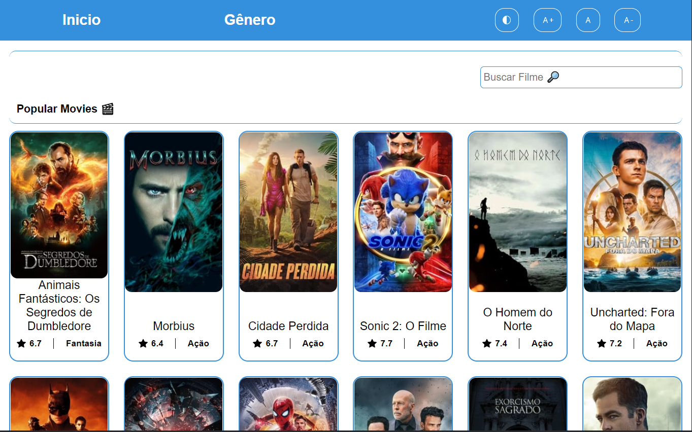
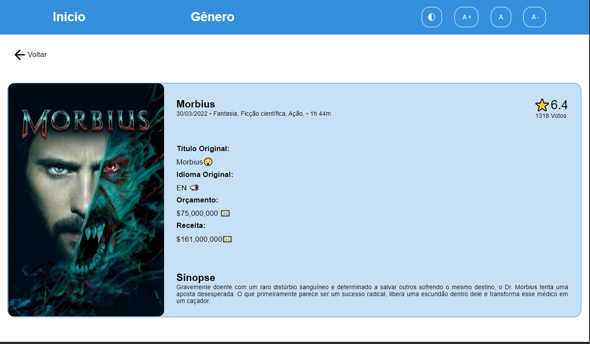
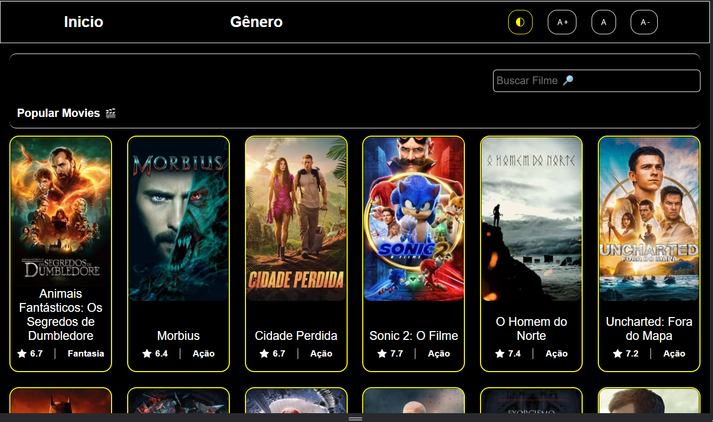
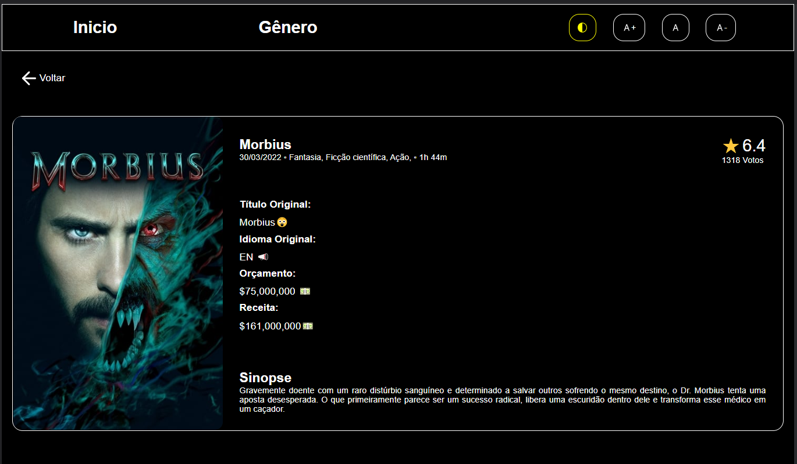

<h1 align="center">
    <strong>Movie Challenge</strong>
</h1>
<br>

## 📋 summary

<ul align="left">
    <li>
      <a href="#-tecnologias">Technology</a>&nbsp;&nbsp;&nbsp;&nbsp;&nbsp;&nbsp;
    </li>
    <li>
      <a href="#-projeto">About the project</a>&nbsp;&nbsp;&nbsp;&nbsp;&nbsp;&nbsp;
    </li>
    <li>
      <a href="#-layout">Functionalities</a>&nbsp;&nbsp;&nbsp;&nbsp;&nbsp;&nbsp;
    </li>
    <li>
      <a href="#-layout">Layout</a>&nbsp;&nbsp;&nbsp;&nbsp;&nbsp;&nbsp;
    </li>
    <li>
      <a href="#-como-executar">How to Use</a>&nbsp;&nbsp;&nbsp;&nbsp;&nbsp;&nbsp;
    </li>
</ul>

## 📋 Deploy

- [Visit app](https://movie-challenge-gilt.vercel.app/#/)
## ✨ Technology

This project was developed with the following technologies:

- [React](https://reactjs.org/)
- [TypeScript](https://www.typescriptlang.org/)
- [Nodejs](https://nodejs.org/en/)
- [Styled-Components](https://styled-components.com/)
- [Visual studio code](https://code.visualstudio.com/)

## 💻 About the project

The project consists of showing a catalog of films, providing a good user experience, allowing the listing of films organized into different categories (genres), performing searches by title and viewing detailed information about a film (ex: synopsis, year, duration, cast, etc.). Using [The Movie DB API](https://www.themoviedb.org/documentation/api)

## 🛠️ Functionalities

- list movies
- Search by movie names
- view movie details

- Among many other amazing things!

## 🔖 Layout
<br >

<p align="center">
    <apan align="center">
      
      
      
      
    </apan>
</p>

<br >

## 🚀 How to Use

```
- Clone this repository:
$ git clone https://github.com/erikbernard/movie-challenge.git

- Enter in directory:
$ cd DevQuiz

- For install dependencies:
$ npm Install

- Run the app:
$ npm start
```

---
